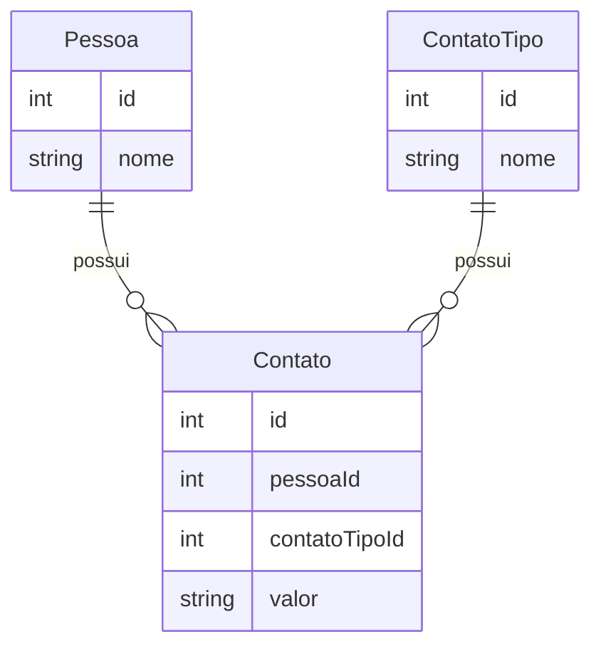

.

# [Bravi](https://bravi.com.br/) | Desafio Cadastro - Back End
O desafio consiste em criar uma WebApi em ASP.NET utilizando C#. As principais funcionalidades consistem em cadastrar pessoas e seus respectivos meios de contato, e também o tipo de contato disponível.

## Stack Utilizada
| Tecnologia                               | Descrição                                                                                   |
|------------------------------------------|--------------------------------------------------------------------------------------------|
| [ASP.NET 7.0](https://dotnet.microsoft.com/apps/aspnet) | Framework de desenvolvimento web para construir aplicativos escaláveis, robustos e seguros. |
| [Entity Framework](https://docs.microsoft.com/en-us/ef/) | Mapeamento objeto-relacional (ORM) que permite trabalhar com bancos de dados usando objetos .NET. |
| [SQLite](https://www.sqlite.org/)        | Biblioteca de banco de dados SQL embutida que não requer um servidor separado.          |
| [AutoMapper](https://automapper.org/)   | Biblioteca para mapeamento de objetos em .NET.                                        |
| [xUnit](https://xunit.net/)             | Framework de teste unitário para .NET.                                                |
| [Migrations](https://docs.microsoft.com/en-us/ef/core/managing-schemas/migrations/) | Recurso do Entity Framework para gerenciamento de alterações no esquema do banco de dados. |
| [JsonPatch](https://www.nuget.org/packages/Microsoft.AspNetCore.JsonPatch/) | Biblioteca para aplicar patches em documentos JSON de forma eficiente e rápida em aplicações ASP.NET Core. |

---

### Detalhes sobre a solução e a arquitetura
Solução arquitetarda em projetos: Data, Tests e WebApi.
O projeto Data conta com Repository Pattern, Migrations e o Entity Framework com o DataContext, utilizando Code First para gerar as entidades no banco de dados.\
O projeto Tests conta com xUnit para testes unitarios e possui testes no respositório base, dessa forma validando na prática, por completo, a principal função dessa solução.\
O projeto WebApi é a camada de saida e entrada dos dados via API Rest e conta com uma classe genérica chamada  GenericCrudController que implementa de forma padronizada os métodos Get, Post, Patch e Delete, e os controllers individuais para cada entidade ficam encarregados de sobrescrever o método que lhe interessa que seja diferente da implementação padrão. 

\
\
\
Feito por [Evilazio Ricarte](https://www.linkedin.com/in/evilazio-ricarte-29ab4a1a8/)
### 😉